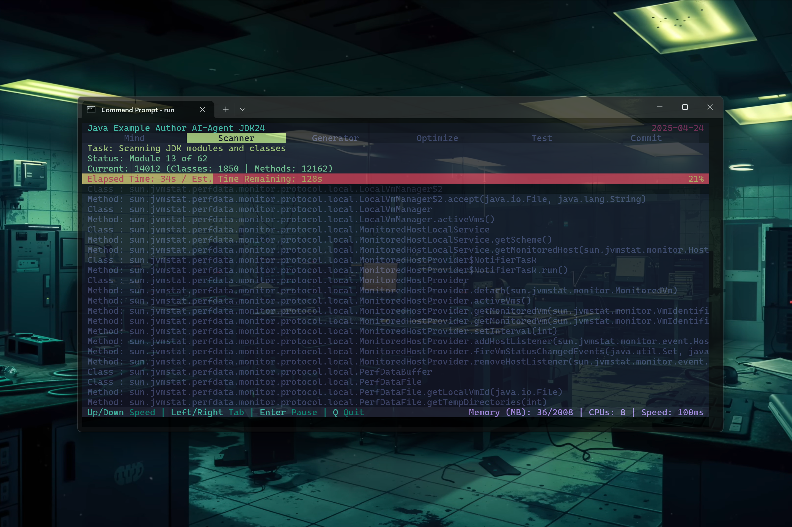

[▶️ Watch the video](media/video.mp4)




```markdown
# Java Examples for JDK 17

This project automatically creates beginner-friendly Java example programs — for  
**every single Java command**. It's a one-day experiment using Ollama and `stable-code`,  
built for educational purposes.

## What is it?

I built a system that scans the entire Java language and collects around **24,904 classes**  
and **169,194 methods** (like a dictionary). Then, using `ollama run stable-code`, it asks  
an AI locally to generate one **simple example per command**.  
It's not perfect, but it works. It runs in the background on my machine, and I occasionally  
commit the new files. Yes — 194,098 code snippets. No manual work. Pure automation.

## Why?

- One-day project, started in the morning, finished at night  
- Oracle provides documentation, but not per-command examples — I thought of “processing” 
- This is for **learners**, not experts  
- See a command → see how it works. Simple.  
- I’ve never read the entire JDK!

## How?

- Language: **Java**
- Install [`ollama`](https://ollama.com)
- Install AI Model: [`stable-code`](https://ollama.com/library/stable-code), or another   
- In the terminal, run: `ollama run stable-code` and wait for the download  
- Open your IDE  
- Use **JDKClassScanner** and **JDKMethodScanner** to generate the text files  
- Add [`json.jar`](https://repo1.maven.org/maven2/org/json/json/20231013/json-20231013.jar)
  to your classpath  
- Run **JDKExampleGenerator** locally with one of the files (set `INPUT_FILE`)  
- Time estimate: one full pass = **343.5 days** nonstop (about one file every 2.9 minutes 🫠)  
  I might need more machines... or an NPU.

## Goal

A **huge open-source book** with every Java command + example.  
Built to truly help beginners. Really! I should do the same to refresh my C# knowledge.  
Published weekly on GitHub. Free.  
One-day project, long-term consequences for my machine.  
Currently messy, but improving. Perfection needs a few more days.

## Motivation

> *“Aus dem gelernten AI-Chatbot-Wissen muss ja etwas werden.”*  
(German: “Something has to come from all this AI chatbot knowledge.”)

I wanted to build something real with AI — and now I can.  
Maybe one day, someone Googles a Java command, lands here, and learns something... with my name on it.  
Otherwise, just use a chatbot. This was for fun.

## Status

⏳ Generating... publishing updates weekly.  
> Sitting in a hacker's caravan, letting androids and servers do the job.

## Next
Another program to create syntax highlited beautiful pages in HTML + CSS. 
---

! Solo dev. 194k examples. Let’s see what happens.
  ``` 
